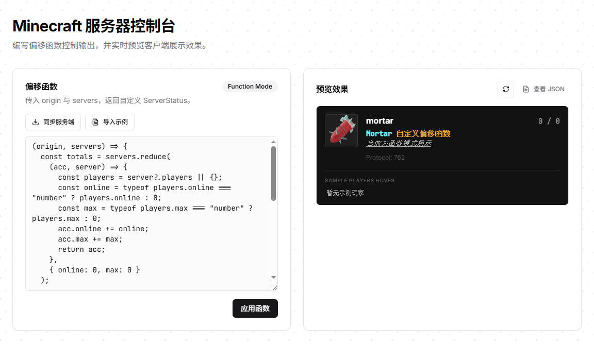

# Ghost Ping

## 简介

GP 是一个轻量化的幽灵 MineCraft 服务端应用，利用 List Ping 协议达成对客户端的各种显示效果。  
现在支持使用 **JavaScript 函数** 做偏移与重载，可以对服务端列表进行聚合与再加工。




***修改后***：


## 一键安装

为了简化安装过程，特别提供了一键安装脚本，适用于Windows和Linux系统。请根据您的操作系统执行相应的命令。

### Windows

在Windows系统中，您可以通过运行以下PowerShell命令来启动安装过程：

```powershell
Invoke-WebRequest -Uri "https://raw.githubusercontent.com/MortarHQ/GhostPing/master/docs/scripts/install.bat" -OutFile "install.bat"; .\install.bat
```

这条命令会自动从项目仓库下载安装脚本并立即执行它（脚本内部使用 pnpm 安装依赖）。

### Linux

在Linux系统中，您可以使用以下命令来一键安装：

```bash
curl -sL https://raw.githubusercontent.com/MortarHQ/GhostPing/master/docs/scripts/install.sh > install.sh && bash install.sh
```

这条命令会从您的项目仓库下载安装脚本并立即执行它（脚本内部使用 pnpm 安装依赖）。

**注意**：出于安全考虑，运行来自互联网的脚本之前，请确保您已经审核了脚本的内容。

## 主要技术栈

- **Node.js net/http**: 原生 TCP + HTTP 处理
- **TypeScript**: `JavaScript` 的一个超集，增加了类型系统
- **Pino**: 日志系统
- **LSP**: `MineCraft` 服务器状态获取协议

## 项目结构

- `src/app.ts` 和 `src/appServer.ts`: HTTP 处理器与 TCP+HTTP 统一入口。
- `src/mcClient.ts` 与 `test.json`: 模拟 Minecraft 客户端请求并输出结果。
- `src/config` 目录: 配置解析逻辑。
- `public` 目录: Web 控制台静态资源。
- `src/utils` 目录: 工具函数与协议实现。
- `data/offset.fn.js`: 偏移函数文件（由服务端启动时自动创建/读取）。

## 安装与运行

### 安装依赖

在项目根目录下运行以下命令安装依赖：

```bash
pnpm install
```

### 开发模式

要在开发模式下运行前端和守护进程，请执行：

```bash
pnpm run dev
```

### 生产模式

要在生产模式下运行前端和守护进程，请执行：

```bash
pnpm start
```

### 客户端请求

模拟 Minecraft 客户端访问任意服务端：

```bash
pnpm run mc:ping -- <host:port> --version 1.16.5
```

默认输出到 `test.json`。也可以通过环境变量指定：

```bash
MC_HOST=bgp.mortar.top MC_PORT=25565 MC_VERSION=1.16.5 MC_OUT=test.json pnpm run mc:ping
```

## 配置文件

项目配置位于 `data/config.toml`，修改后重启生效。

示例：

```toml
[[server_list]]
host = "fun.mortar.top"
port = "25565"
version = "1.16.5"

# [[server_list]]
# host = "minecraft.net"
# port = "25565"
# version = "1.20.4"

[server]
port = "25565"
web_port = "24680"
web_host = "127.0.0.1"
host = "0.0.0.0"
logLevel = "info"
logFormat = "combined"
```

说明：

- `server_list`: 要聚合的真实服务器列表（用于生成偏移输入数据）。
- `server.port`: TCP 监听端口（Minecraft 客户端连接）。
- `server.web_port`: Web 控制台端口（默认 `24680`）。
- `server.web_host`: Web 控制台监听地址（默认 `127.0.0.1`）。
- `server.host`: 监听地址。

**安全警告**：Web 控制台可以执行偏移函数，这相当于在服务端执行 JavaScript。  
强烈建议保持 `server.web_host = "127.0.0.1"`，避免外网访问。  
将其改为 `0.0.0.0` 会直接暴露控制台到公网，存在高风险。

## 偏移函数（函数模式）

偏移函数存放在 `data/offset.fn.js`，这是一个 **ESM 模块文件**。  
服务端启动时会自动读取，不存在则写入默认模板。  
要求：必须 `export default` 一个函数。

```js
export default (origin, servers) => {
  // origin: 聚合后的基准对象（已包含版本、玩家、描述、图标等）
  // servers: server_list 中成功获取的状态列表
  return {
    // 返回的字段会合并到 origin 中
  };
};
```

一个示例：

```js
export default (origin, servers) => {
  const totals = servers.reduce(
    (acc, s) => {
      const online = typeof s?.players?.online === "number" ? s.players.online : 0;
      const max = typeof s?.players?.max === "number" ? s.players.max : 0;
      acc.online += online;
      acc.max += max;
      return acc;
    },
    { online: 0, max: 0 }
  );

  return {
    players: {
      online: totals.online,
      max: totals.max,
    },
    description: [
      "",
      { text: "Mortar", bold: true, color: "aqua" },
      { text: `\\n聚合 ${servers.length} 个服务器`, color: "gray" },
    ],
  };
};
```

服务端会用模拟的 server_list 结果验证函数返回值结构，校验通过后才会生效并写入 `data/offset.fn.js`。

## Web 控制台使用方式

浏览器访问：`http://<host>:24680`。

建议使用流程：

1. 点击“获取服务端函数”，加载当前生效的偏移函数。
2. 在“函数内容（JavaScript）”中编辑或粘贴你的函数。
3. 点击“应用函数”，服务端验证通过后即刻生效，并保存到 `data/offset.fn.js`。
4. 点击“刷新预览”，查看 Minecraft 预览卡片。
5. 点击卡片右上角“显示源格式”，可查看原始 JSON 并复制。

提示：偏移函数只需要返回 **要覆盖的部分**，系统会将其合并到默认的 `origin` 基准对象中。

## 贡献

欢迎通过 Pull Requests 或 Issues 来贡献您的代码或提出您的建议。

## 许可信息

NONE

---

感谢您对本项目的关注，希望它能帮助您更好地了解和使用Minecraft List Ping协议
